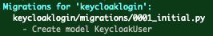

# Keycloak Django Integration

# 1. Overview

This project is a simple Django project that demonstrates integration with the OAUTH/OIDC Keycloak ID provider (IDP).  The functionality provided demonstrates:

  * Requiring authentication for resources using the `login_required` decorator
  * Requiring that an authenticated user belongs to a role using a custom decorator `role_required`
  * Invalidating idle sessions
  * Invalidating session when browser is closed and re-opened
  * Invalidating session and login session with keycloak, when the logout function is activated.
 
> **NOTE** This project contains 'start for 10' credentials for things like postgres and keycloak to get you up and running purely for dev purposes. Do not
> use these credentials for production!!

## 1.1 Pre-requisites

### 1.1.1 Python3 Virtual Environment

Although this is not a hard dependency, it is highly recommended that you create a python3 virtual environment

    python3 -m venv pyenv
    . pyenv/bin/activate
    pip install -r requirements.txt

The above commands will setup your virtual environment and install django, requests, and psycopg2

### 1.1.2 Postgres Server

This django project has been configured to use postgres.  It is suggested that you run this in a docker container built from a suitable postgres image.
For example, to use the official postgres image:

    docker run -d --name djangokcdb -e POSTGRES_PASSWORD=password -p 5432:5432 postgres

We will now need to carry out the following actions:

  * Ensure to set the password for the postgres user if it differs from original setup. 
  * Create the keycloakauth database

You will need to now run an interactive session with postgres and carry out the above:

    docker exec -it djangokcdb psql -U postgres
    
    postgres=# ALTER ROLE postgres WITH PASSWORD 'password';
    postgres=# create database keycloakauth;
    postgres=# \q
    exit

### 1.1.3 Keycloak Server

The keycloak server wil provide all the authentication services and hold the roles that users are allowed to perform.  Keycloak can be started in a docker
container by using the following command:

    docker run -d -p 5392:8080 --name keycloak -e KEYCLOAK_USER=admin -e KEYCLOAK_PASSWORD=admin quay.io/keycloak/keycloak:15.0.2

> **NOTE** Change the admin credentials to suit.

Once Keycloak has been started you will need to open a browser session to [Keycloak Server](http://localhost:5392/auth/admin/)

Click on **Administration Console**

We now need to import our realm configuration into keycloak.  First, hover your mouse over the *Master* Realm, then click **Create Realm**

The realm configuration used in this PoC has been exported and provided with this project.  This can be imported to setup
the realm.

Click **Select File**, navigate to this project and select the file `keycloak-myrealm.json`

This will fill in the realm name.  Click **Create** to create the `myrealm` realm which has the configuration of
the client **djangokcpoc**, and has two client roles added:

  * Test
  * Security

In addition, there are two role mappings that are presented to the userinfo object.
                                                                      
The "username" mapper maps the preferred_username field to the tag username in the userinfo object.

                                                                               
The "client roles" mapper maps the roles associated with a user to the userinfo object. 

You now need to add four users:

  * test - This user will be assigned to the Test role
  * security - This user will be assigned to the Security role
  * superuser - This user will be assigned to both Test and Security roles
  * roleless - This user will not be assigned to any roles

                                                      
Click on users, then **Add User**

                                             
Fill out the details as below

 
You will need to set the initial credentials for the Test user.  Click on the **Credentials** tab, then 
add the credentials.

When you click the **Set Password** button you will be presented with:

Click **Set Password to confirm.

Repeat the above process for the **superuser**, **security**, and **rolesess** users.  With all the users setup,
we now need to assign them to the required roles.  From the users screen, click on the **Test** user then click on the **Role Mapping** tab, 
select the djangokcpoc from the **Client Roles** dropdown, the select the *Test* role and click **Add Selected**

Go back to the main users screen and select the *superuser* user and repeat the above process but ensure that both
*Test* and *Security* roles have been assigned.

                                                                 
Go back to the main users screen and select the **security** user amd repeat the process for setting credentials, then ensure that
just the *Security* role is assigned.

As we are not assigning any roles to the *roleless* user, there is nothing further to be done.

At this point, Keycloak is setup and ready to use.

> **NOTE** The interaction with the client is set to public.  If you want clients to authenticate, set the access type to *confidential*
> 
> 
> 
> You will need to get the '**client_secret** from the '*Credentials*' tab
> 
> 
> 
> Copy the value displayed in the 'Secret' field on your system and put it as the
> value for the variable **KEYCLOAK_CLIENT_SECRET** in the file *environment.py* in the *keycloakpoc/keycloakpoc* folder (next to settings.py)
>
> e.g. using the value displayed above as an example:
>
> `KEYCLOAK_CLIENT_SECRET = '6567c230-fdc9-46fd-871f-99c35df9a739'`
>
> *environment.py* is **NOT** part of the checked in project.  This file is for local variable overrides only.

# 2. Running up the Django keycloakpoc Application

The django application requires that the database is initialised.

    python manage.py makemigrations keycloaklogin

    python manage.py migrate

You can now start the application with

    python manage.py runserver

Click on [Main Page](http://localhost:8000) to access the home page of the application.

## 2.1 Login With Test user

Click the 'Resource for members of the Test role' link, then login with the **test** user.  You should see the screen below.

This has been validated against the role stipulated as a requirement for accessing this page.
The page then displays each role and it's status by checking in the HTML to display it's validation status.  This
shows another way the role data can be used, however, it is recommended to use the `@role_required` in the first instance.

Click the **Logout** link to invoke the logout function.  This wil invalidate the session and also log
the user out of the keycloak auth system.

> **NOTE** You don't have to logout of the keycloak system.  This is an application decision.  If you
> left the user logged in to keycloak, then the application would silently get the authorisation.
      
## 2.4 Login with the security user

Click on the 'Resource for members of the Security role' link, and login as the **security** user.  You should see:

This time, click the 'Home' link, then click on 'Resource for members of the Test Role' link.  This will return an  error message

Click Logout.

## 2.3 Login with Superuser

From the home page, click on either resource link and login as the **superuser**.  You should see that both roles are authorised for this user.

                                                               
This user belongs to both roles and so this is reflected in he output.

## 2.4 Login with roleless user

The roleless user has not ha dany roles associated with it.  Login as the **roleless** user.

                                                      
This has followed a different path in the application. We have used a custom decorator called `@role_required` for
the main page of our application.  This means that to get to the page requires you to be in the give role (Test in this case).
As the roleless user doens't have any roles, an error message is returned with a status code of 403.

## 2.5 Local Environment Settings

There are a number of configuration items that are specific to a runtime implementation, such as database usernames,
hostnames, ports, credentials etc.  The project [settings.py](keycloakpoc/settings.py) file, has a number of defaults for
such values which can be overriden if included in a special file called [environment.py](keycloakpoc/environment.py)

The *environment.py* is not required if running as the default dev setup and is specifically not, and should not be, included in this project.
The following variables can be overridden if included in your local *environment.py* file:

    APP_BASE_URL
    KEYCLOAK_BASE_URL
    KEYCLOAK_CLIENT_ID
    KEYCLOAK_CLIENT_SECRET
    DB_USER
    DB_PASS
    DB_NAME
    DB_HOST
    DB_PORT

